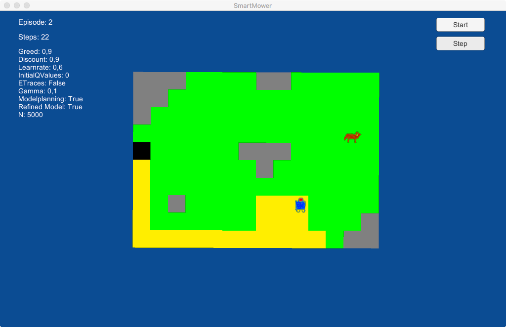

# Das Problem
Die zu lösende Aufgabe besteht darin, eine möglichst effiziente Steuerung für einen autonomen 
Rasenmähroboter zu finden.
Dieser agiert in einem  Garten fester Größe, dessen genauer Aufbau anfänglich jedoch nicht bekannt ist.
Dem Roboter stehen dabei nur Sensoren zu Verfügung, mit denen er seine lokale Umgebung wahrnehmen kann.
Die Idee dieses Projekts ist es, das Erlernen einer solchen Steuerung als Reinforcement Learning 
Problem zu formulieren.
Während Reinforcement Learning im Kontext der allgemeinen Robotik bereits intensiv untersucht 
wurde^[ [http://www.ias.tu-darmstadt.de/uploads/Publications/Kober_IJRR_2013.pdf](http://www.ias.tu-darmstadt.de/uploads/Publications/Kober_IJRR_2013.pdf)], 
ist den Autoren keine Betrachtung dieses konkreten Anwendungsfalls bekannt.

# Modellierung

Ausgangspunkt für den Rasenmähroboter ist dessen Umgebung -- der Garten den es zu mähen gilt. 
Dieser wird modellhaft als diskretes zweidimensionales Raster fester Größe aus einzelnen Gartenzellen 
repräsentiert. Jede dieser Zellen ist gleich groß und kann verschiedene Zustände einnehmen:

+ Hohes Gras
+ Gemähtes Gras
+ Hindernis (z.B. ein Stein)
+ Basisstation des Mähroboters

Eine entsprechende Farbcodierung dieser Zustände, wie sie auch in der Simulation verwendet wird, ist
in Abbildung \ref{fig:colorcoding} zu sehen. Der Mähroboter ist mit Sensoren ausgestattet, 
um den Zustand der umliegenden Gartenzellen wahrzunehmen.\
Innerhalb des Gartens können sich verschiedene Objekte frei bewegen:

+ Der Mähroboter
+ Bewegliche Hindernisse (z.B. Hunde)

Diese werden in der Simulation wiederum gemäß Abbildung \ref{fig:colorcoding} dargestellt. 
Während die Steuerung des Roboters erlernt werden soll, bewegen sich die beweglichen Hindernisse 
zufällig durch die Gartenwelt.\
Alle Bewegungen von Objekten im Garten erfolgen in diskreten Zeitschritten. Dies ist zusammen mit der 
diskreten Modellierung des Gartens den verwendeten Reinforcement Learning Algorithmen geschuldet. 
Diese erfordern zwingend ein Problem diskreter Natur mit endlicher Komplexität.\

Um das Problem mithilfe von Reinforcement Learning zu lösen ist es notwendig, den Zustandsraum und 
die Aktionen des Roboters sowie die verwendete Belohnungsfunktion zu definieren. Dies wird im Nachfolgenden 
beschrieben.

\begin{figure}
\centering
\begin{tikzpicture}[object/.style={thin,double,<->}]
         \node (t0) at (-7,0) [largetile, fill=black, label=south:Basisstation] {};
         \node (t1) at (-4.5,0) [largetile, fill=grass, label=south:Hohes Gras] {};
         \node (t2) at (-2,0) [largetile, fill=empty, label=south:Gemähtes Gras] {};
         \node (t3) at (0.5,0) [largetile, fill=stone, label=south:Hindernis] {};
         \node (t4) at (3,0) [largetile, fill=white, label=south:Mähroboter] {\includegraphics[width=1.7em]{mower.png}};       

	  \node (t5) at (5.5,0) [largetile, fill=white, label=south:Hund] {\includegraphics[width=1.7em]{dog.png}};
\end{tikzpicture}

\caption{Farbcodierung der Gartenzellen sowie der beweglichen Objekte.\label{fig:colorcoding}}
\end{figure}

\begin{figure}
\begin{minipage}[t]{.4\textwidth}
  \begin{center}
  \begin{tikzpicture}

      	 \node (t) at (0em,0em) [largetile, fill=empty] {\includegraphics[width=1.7em]{mower.png}}; 
      	 \node (tne) at (2em,2em) [largetile, fill=stone] {};
      	 \node (tse) at (2em,-2em) [largetile] {};
      	 \node (tsw) at (-2em,-2em) [largetile] {};
      	 \node (tnw) at (-2em,2em) [largetile] {};
	 \node (tn) at (0em,2em) [largetile, draw=red, thick] {};
      	 \node (te) at (2em,0em) [largetile, draw=red, thick] {};
      	 \node (ts) at (0em,-2em) [largetile, fill=empty, draw=red, thick] {};
      	 \node (tw) at (-2em,0em) [largetile, draw=red, thick] {};
	 
  \end{tikzpicture}
  \end{center}
  \end{minipage}
  \hfill
  \begin{minipage}[t]{.4\textwidth}
  \begin{center}
  \begin{tikzpicture}

      	 \node (t) at (0em,0em) [largetile, fill=empty] {\includegraphics[width=1.7em]{mower.png}};
	 \node (tn) at (0em,2em) [largetile, draw=red, thick] {};
      	 \node (tne) at (2em,2em) [largetile, fill=stone, draw=red, thick] {};
      	 \node (te) at (2em,0em) [largetile, draw=red, thick, draw=red, thick] {};
      	 \node (tse) at (2em,-2em) [largetile, draw=red, thick] {};
      	 \node (ts) at (0em,-2em) [largetile, fill=empty, draw=red, thick] {};
      	 \node (tsw) at (-2em,-2em) [largetile, draw=red, thick] {};
      	 \node (tw) at (-2em,0em) [largetile, draw=red, thick] {};
      	 \node (tnw) at (-2em,2em) [largetile, draw=red, thick] {};

  \end{tikzpicture}
  \end{center}
  \end{minipage}

  \caption{Vergleich der Zustandsvarianten: Links enthält der Zustand des Roboters die Zustände 
  der umgebenden vier Gartenzellen, rechts der umliegenden acht.\label{fig:statecomparison}}
  
  \end{figure}

## Zustandsraum

Der Zustand des Roboter beschreibt das Wissen über sich selbst und seine Umgebung, 
auf Basis dessen er die Entscheidung über seine nächste Aktion trifft. 
Um die Größe des Zustandsraums übersichtlich zu halten wird der Zustand so modelliert, 
dass er nur die lokale und direkt wahrnehmbare Umgebung des Roboters beschreibt. 
Im Detail werden drei Zustandsvarianten untersucht:

1. Zustand der umgebenden vier Gartenzellen
2. Zustand der umgebenden acht Gartenzellen
3. Zustand der umgebenden acht Gartenzellen + Koordinaten des Roboters

Die ersten beiden Varianten sind in Abbildung \ref{fig:statecomparison} dargestellt. \
Die maximale Größe des Zustandsraums ist für Variante drei damit gegeben als \
$\lbrace\text{Anzahl Zustände einer Gartenzelle}\rbrace^8 * \lbrace\text{Gartengröße}\rbrace$.

## Aktionen
Die möglichen Aktionen des Mähroboters beschränken sich auf Bewegungen in einer der vier Himmelsrichtungen. 
Eine Bewegung ist nur dann möglich, wenn die entsprechende Gartenzelle nicht durch ein Hindernis belegt ist.\
Bewegt sich der Roboter auf eine Gartenzelle mit hohem Gras, so gilt diese Zelle als gemäht. 
Vom konkreten Mähvorgang dieser Zelle wird in der Simulation abstrahiert.

## Belohnungsfunktion
Die Belohnungsfunktion zur Bewertung der Aktionswahl des Roboters ist sehr einfach definiert.
Der Roboter erhält nach jeder Aktion eine Belohnung von

+ $+10$, falls er sich auf ein Feld mit hohem Gras bewegt hat,
+ $-1$, sonst.

\begin{figure}
\begin{minipage}[t]{.4\textwidth}
  \begin{center}
  \begin{tikzpicture}

    \begin{scope}[node distance=0pt]
         \node (c0) at (-6.0em,4.5em) [tile, fill=black] {};
         \node (c1) at (-4.5em,4.5em) [tile] {};
         \node (c2) at (-3.0em,4.5em) [tile] {};
         \node (c3) at (-1.5em,4.5em) [tile] {};
         \node (c4) at (0.0em,4.5em) [tile, fill=stone] {};
         \node (c5) at (1.5em,4.5em) [tile, fill=stone] {};
         \node (c6) at (3.0em,4.5em) [tile, fill=stone] {};
         \node (c7) at (4.5em,4.5em) [tile, fill=stone] {};
         \node (c8) at (6.0em,4.5em) [tile, fill=stone] {};
         \node (c9) at (-6.0em,3.0em) [tile, fill=empty] {};
         \node (c10) at (-4.5em,3.0em) [tile, fill=empty] {};
         \node (c11) at (-3.0em,3.0em) [tile, fill=empty] {};
         \node (c12) at (-1.5em,3.0em) [tile] {};
         \node (c13) at (0.0em,3.0em) [tile] {};
         \node (c14) at (1.5em,3.0em) [tile, fill=empty] {};
         \node (c15) at (3.0em,3.0em) [tile, fill=empty] {};
         \node (c16) at (4.5em,3.0em) [tile, fill=stone] {};
         \node (c17) at (6.0em,3.0em) [tile, fill=empty] {};
         \node (c18) at (-6.0em,1.5em) [tile] {};
         \node (c19) at (-4.5em,1.5em) [tile] {};
         \node (c20) at (-3.0em,1.5em) [tile, fill=empty] {};
         \node (c21) at (-1.5em,1.5em) [tile, fill=empty]  {\includegraphics[width=1.2em]{mower.png}};
         \node (c22) at (0.0em,1.5em) [tile, fill=empty] {};
         \node (c23) at (1.5em,1.5em) [tile, fill=empty] {};
         \node (c24) at (3.0em,1.5em) [tile, fill=empty] {};
         \node (c25) at (4.5em,1.5em) [tile, fill=empty] {};
         \node (c26) at (6.0em,1.5em) [tile, fill=empty] {};
         \node (c27) at (-6.0em,-0.0em) [tile] {};
         \node (c28) at (-4.5em,-0.0em) [tile] {};
         \node (c29) at (-3.0em,-0.0em) [tile] {};
         \node (c30) at (-1.5em,-0.0em) [tile] {};
         \node (c31) at (0.0em,-0.0em) [tile] {};
         \node (c32) at (1.5em,-0.0em) [tile, fill=stone] {};
         \node (c33) at (3.0em,-0.0em) [tile, fill=stone] {};
         \node (c34) at (4.5em,-0.0em) [tile, fill=empty] {};
         \node (c35) at (6.0em,-0.0em) [tile] {};
         \node (c36) at (-6.0em,-1.5em) [tile, fill=stone] {};
         \node (c37) at (-4.5em,-1.5em) [tile] {};
         \node (c38) at (-3.0em,-1.5em) [tile] {};
         \node (c39) at (-1.5em,-1.5em) [tile] {};
         \node (c40) at (0.0em,-1.5em) [tile] {};
         \node (c41) at (1.5em,-1.5em) [tile, fill=stone] {};
         \node (c42) at (3.0em,-1.5em) [tile, fill=stone] {};
         \node (c43) at (4.5em,-1.5em) [tile, fill=empty] {};
         \node (c44) at (6.0em,-1.5em) [tile] {};
         \node (c45) at (-6.0em,-3.0em) [tile, fill=stone] {};
         \node (c46) at (-4.5em,-3.0em) [tile, fill=stone] {};
         \node (c47) at (-3.0em,-3.0em) [tile] {};
         \node (c48) at (-1.5em,-3.0em) [tile]  {\includegraphics[width=1.2em]{dog.png}};
         \node (c49) at (0.0em,-3.0em) [tile] {};
         \node (c50) at (1.5em,-3.0em) [tile] {};
         \node (c51) at (3.0em,-3.0em) [tile] {};
         \node (c52) at (4.5em,-3.0em) [tile, fill=empty] {};
         \node (c53) at (6.0em,-3.0em) [tile] {};
         \node (c54) at (-6.0em,-4.5em) [tile, fill=stone] {};
         \node (c55) at (-4.5em,-4.5em) [tile, fill=stone] {};
         \node (c56) at (-3.0em,-4.5em) [tile, fill=stone] {};
         \node (c57) at (-1.5em,-4.5em) [tile] {};
         \node (c58) at (0.0em,-4.5em) [tile] {};
         \node (c59) at (1.5em,-4.5em) [tile] {};
         \node (c60) at (3.0em,-4.5em) [tile, fill=empty] {};
         \node (c61) at (4.5em,-4.5em) [tile, fill=empty] {};
         \node (c62) at (6.0em,-4.5em) [tile] {};
         
         % movement arrows
        	 \draw[-stealth, black, thick] (c21.mid) -- (c30.mid);  
        
	\end{scope}

	 
  \end{tikzpicture}
  \end{center}
  \end{minipage}
  \hfill
  \begin{minipage}[t]{.4\textwidth}
  \begin{center}
  \begin{tikzpicture}    \begin{scope}[node distance=0pt]
         \node (c0) at (-6.0em,4.5em) [tile, fill=black] {};
         \node (c1) at (-4.5em,4.5em) [tile] {};
         \node (c2) at (-3.0em,4.5em) [tile] {};
         \node (c3) at (-1.5em,4.5em) [tile] {};
         \node (c4) at (0.0em,4.5em) [tile, fill=stone] {};
         \node (c5) at (1.5em,4.5em) [tile, fill=stone] {};
         \node (c6) at (3.0em,4.5em) [tile, fill=stone] {};
         \node (c7) at (4.5em,4.5em) [tile, fill=stone] {};
         \node (c8) at (6.0em,4.5em) [tile, fill=stone] {};
         \node (c9) at (-6.0em,3.0em) [tile, fill=empty] {};
         \node (c10) at (-4.5em,3.0em) [tile, fill=empty] {\includegraphics[width=1.2em]{mower_transparent.png}};
         \node (c11) at (-3.0em,3.0em) [tile, fill=empty] {};
         \node (c12) at (-1.5em,3.0em) [tile] {};
         \node (c13) at (0.0em,3.0em) [tile] {};
         \node (c14) at (1.5em,3.0em) [tile, fill=empty] {};
         \node (c15) at (3.0em,3.0em) [tile, fill=empty] {};
         \node (c16) at (4.5em,3.0em) [tile, fill=stone] {};
         \node (c17) at (6.0em,3.0em) [tile, fill=empty] {};
         \node (c18) at (-6.0em,1.5em) [tile] {};
         \node (c19) at (-4.5em,1.5em) [tile] {};
         \node (c20) at (-3.0em,1.5em) [tile, fill=empty] {};
         \node (c21) at (-1.5em,1.5em) [tile, fill=empty]  {\includegraphics[width=1.2em]{mower.png}};
         \node (c22) at (0.0em,1.5em) [tile, fill=empty] {};
         \node (c23) at (1.5em,1.5em) [tile, fill=empty] {};
         \node (c24) at (3.0em,1.5em) [tile, fill=empty] {};
         \node (c25) at (4.5em,1.5em) [tile, fill=empty] {};
         \node (c26) at (6.0em,1.5em) [tile, fill=empty] {\includegraphics[width=1.2em]{mower_transparent.png}};
         \node (c27) at (-6.0em,-0.0em) [tile] {};
         \node (c28) at (-4.5em,-0.0em) [tile] {};
         \node (c29) at (-3.0em,-0.0em) [tile] {};
         \node (c30) at (-1.5em,-0.0em) [tile] {};
         \node (c31) at (0.0em,-0.0em) [tile] {};
         \node (c32) at (1.5em,-0.0em) [tile, fill=stone] {};
         \node (c33) at (3.0em,-0.0em) [tile, fill=stone] {};
         \node (c34) at (4.5em,-0.0em) [tile, fill=empty] {};
         \node (c35) at (6.0em,-0.0em) [tile] {};
         \node (c36) at (-6.0em,-1.5em) [tile] {};
         \node (c37) at (-4.5em,-1.5em) [tile] {};
         \node (c38) at (-3.0em,-1.5em) [tile] {\includegraphics[width=1.2em]{mower_transparent.png}};
         \node (c39) at (-1.5em,-1.5em) [tile] {};
         \node (c40) at (0.0em,-1.5em) [tile] {};
         \node (c41) at (1.5em,-1.5em) [tile] {};
         \node (c42) at (3.0em,-1.5em) [tile, fill=stone] {};
         \node (c43) at (4.5em,-1.5em) [tile, fill=empty] {};
         \node (c44) at (6.0em,-1.5em) [tile] {};
         \node (c45) at (-6.0em,-3.0em) [tile] {};
         \node (c46) at (-4.5em,-3.0em) [tile] {};
         \node (c47) at (-3.0em,-3.0em) [tile] {};
         \node (c48) at (-1.5em,-3.0em) [tile] {};
         \node (c49) at (0.0em,-3.0em) [tile] {};
         \node (c50) at (1.5em,-3.0em) [tile] {};
         \node (c51) at (3.0em,-3.0em) [tile] {};
         \node (c52) at (4.5em,-3.0em) [tile, fill=empty] {\includegraphics[width=1.2em]{mower_transparent.png}};
         \node (c53) at (6.0em,-3.0em) [tile] {};
         \node (c54) at (-6.0em,-4.5em) [tile] {};
         \node (c55) at (-4.5em,-4.5em) [tile] {};
         \node (c56) at (-3.0em,-4.5em) [tile] {};
         \node (c57) at (-1.5em,-4.5em) [tile] {};
         \node (c58) at (0.0em,-4.5em) [tile] {};
         \node (c59) at (1.5em,-4.5em) [tile] {};
         \node (c60) at (3.0em,-4.5em) [tile, fill=empty] {};
         \node (c61) at (4.5em,-4.5em) [tile, fill=empty] {};
         \node (c62) at (6.0em,-4.5em) [tile] {};	
        
        % movement arrows 
         \draw[-stealth, black, thick] (c21.mid) -- (c30.mid);  
         \draw[-stealth, black!70, thick, dashed] (-4.5em,3.0em) -- (-3.0em,3.0em);           
         \draw[-stealth, black!70, thick, dashed] (c26.mid) -- (c17.mid);     
         \draw[-stealth, black!70, thick, dashed] (c38.mid) -- (c47.mid);     
         \draw[-stealth, black!70, thick, dashed] (4.5em,-3.0em) -- (3.0em,-3.0em);     
         
         \end{scope}

  \end{tikzpicture}
  \end{center}
  \end{minipage}

  \caption{Rechts: Die reale Gartenwelt.\\ Links: Das unvollständige Umgebungsmodell des Roboters. 
  Nach jeder Bewegung werden weitere zufällige Bewegungen im Modell simuliert und darauf gelernt.\label{fig:model}}
  
  \end{figure}

## Algorithmen
Ziel der verwendeten Algorithmen ist es immer, basierend auf dem aktuellen Zustand des Mähroboters 
die optimale Aktion vorauszusagen. Als Ausgangspunkt wird der Q-Learning Algorithmus gewählt, 
welcher sich durch seine simple Implementierung auszeichnet.\
Als Erweiterung davon werden zudem Eligibility Traces verwendet, um auch ganze Bewegungsabläufe 
des Roboters erfassen zu können. \
Als dritte Variante wird zudem noch eine modellbasierte Erweiterung von Q-Learning verwendet, 
welche auf dem DynaQ Algorithmus basiert. Dabei erstellt und aktualisiert der Roboter nach und 
nach ein internes Modell des Gartens, auf welchem er dann zusätzliche Aktionswahlen simulieren 
und darauf lernen kann. Abbildung \ref{fig:model} zeigt den Zusammenhang zwischen der 
echten Gartenwelt und dem internen Modell.

## Messbarkeit 

Als Maß für die Güte der Robotersteuerung wird die Anzahl an Zeitschritten gemessen, 
bis der Roboter den gesamten 
Garten gemäht hat. Dies wird über mehrere Episoden wiederholt.

# Umsetzung und Ergebnis 

## Die Simulation

Die Simulation wird im Rahmen eines Unity-Projekt realisiert, um auch eine geeignete 
graphische Ausgabe zu realisieren. 
Dabei werden die Simulationslogik sowie die verwendeten Lernalgorithmen jedoch so gekapselt, 
dass sie auch außerhalb von Unity verwendet werden können. 
Abbildung \ref{fig:screenshot} zeigt die graphische Oberfläche der Simulation. 
Dabei wird die bereits bekannte Farbcodierung aus Abbildung \ref{fig:colorcoding} verwendet.

{width=80%}

## Experimente: Vergleich der Algorithmen

Alle drei Varianten des Algorithmus werden über $50$ Episoden trainiert. 
Dabei werden jeweils die Zeitschritte gemessen, bis der gesamte Rasen gemäht ist. 
Für alle Varianten wird durch eine Parameter-Optimierung eine optimale Parameterkombination ermittelt. 
Die exakten Parameter sind im [Appendix](#appendix) aufgelistet. Zusätzlich wird als 
Vergleichswert eine Robotersteuerung mit zufälliger Aktionswahl verwendet. 
Als Gartenwelt wird die Welt aus Abbildung \ref{fig:screenshot} mit $123$ zu mähenden Graszellen verwendet.\
Abbildung \ref{fig:results} zeigt die Ergebnisse der Experimente.

{width=90%}

Als oberer Vergleichswert dient das Ergebnis der zufälligen Aktionswahl bei durchschnittlich 
~$1750$ Schritten pro Episode.\
Mit reinem Q-Learning können im Mittel ~$1200$ erreicht werden. 
Dies ist bei $123$ zu mähenden Graszellen jedoch immer noch in etwa das Zehnfache des theoretischen Optimums. 
Auffallend ist, dass sich der erreichbare Lernerfolg schon nach wenigen Episoden einstellt und dann
nicht mehr verbessert. 
Zudem sind immer wieder einzelne Episoden zu erkennen, in denen sehr große 'Ausreißer'-Werte beobachtet
werden können. Diese wirken sich entsprechend negativ auf den Mittelwert über alle $50$ Episoden aus.\
Auch die Erweiterung mit Eligibility Traces bringt keine Verbesserung mit sich -- im Gegenteil. 
Der Mittelwert der benötigten Zeitschritte liegt hier sogar leicht über dem von reinem Q-Learning. 
Der Verlauf über die Zeit ist bei beiden Algorithmen sehr ähnlich.\
Vollkommen anders ist das Ergebnis des modellbasierten Q-Learnings. Hier werden über alle Episoden 
hinweg im Mittel nur ~$180$ Zeitschritte benötigt, was einem Optimum bereits sehr nahe kommt. 
Auch einzelne Episoden mit Extremwerten wie bei den vorigen Algorithmen sind hier nicht zu beobachten. 
Doch auch hier stellt sich der erreichbare Lernerfolg bereits nach sehr wenigen Episoden ein.\
Die für die Experimente verwendete Gartenwelt enthält mit nur einem sich bewegenden Hund sehr 
wenig Dynamik. Ob die verschiedenen Algorithmen in einer Welt mit mehr Dynamik ähnlich abschneiden, 
muss in weiteren Experimenten untersucht werden.

# Appendix: Optimale Parameterkombinationen {#appendix}

Nachfolgend die Auflistung der optimalen Parameterkombinationen, 
welche für die verschiedenen Algorithmen ermittelt wurden. 
Die Benennung der Parameter entspricht der üblichen Benennung die in der Literatur zu 
Reinforcement Learning zu finden ist. 

Parameter      		Wert     	 Beschreibung           
--------------     	--------	 ------------------- 
$\alpha$         	$0.6$         	 Lernrate     
$\gamma$               	$0.8$        	 Diskont-Wert    
$\varepsilon$  	        $0.5$          	 Greediness      

Table: Optimale Parameter für reines Q-Learning.

\newpage

Parameter      		Wert     	 Beschreibung           
--------------     	--------	 ------------------- 
$\alpha$         	$0.7$         	 Lernrate     
$\gamma$               	$0.8$        	 Diskont-Wert    
$\varepsilon$  	        $0.5$          	 Greediness
$\lambda$       	$0.1$    	 Trace-Länge

Table: Optimale Parameter für Q-Learning mit Eligibility Traces.

Parameter      		Wert     	 Beschreibung                         
--------------     	--------	 -------------------------------------
$\alpha$         	$0.6$         	 Lernrate     
$\gamma$               	$0.9$        	 Diskont-Wert    
$\varepsilon$  	        $0.9$          	 Greediness
$N$            		$5000$	 	 Simulierte Schritte pro Zeitschritt

Table: Optimale Parameter für modellbasiertes Q-Learning.
